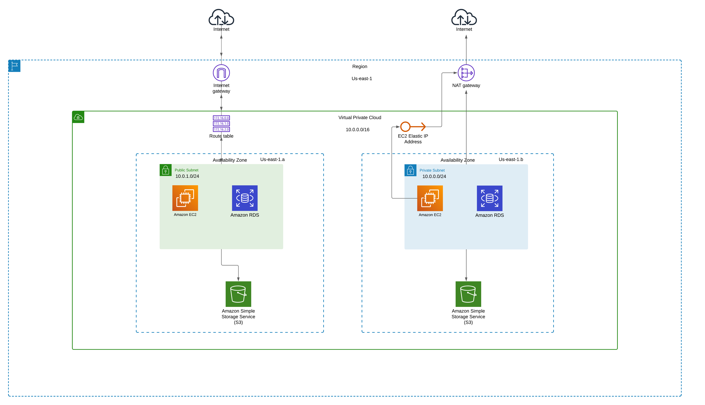

# Infraestructura como Código

## Proyecto
El proyecto consiste en la implementación de una infraestructura en la nube utilizando los servicios de Amazon Web Services (AWS) y gestionándolos como código utilizando Terraform. El objetivo principal es crear una infraestructura escalable, segura y eficiente para alojar aplicaciones y datos.

## Servicios
- VPC (Virtual Private Cloud):
- Subnets:
  1. Subred Pública.

  2. Subred Privada.
  
- Internet Gateway.
- Tabla de Ruteo.
- EC2 Instances: Se crearán dos instancias EC2 para alojar las aplicaciones o servicios deseados.
- Amazon RDS Instances.
- S3 Buckets.

### Diagrama de Arquitectura



## Entorno de desarrollo

- Visual Studio Code(VSCODE): Editor de código Fuente
- AWS Command Line Interface(CLI): Se configurarán las credenciales necesarias para que terraform pueda acceder a la cuenta de AWS para la creación de infraestructura.
- Terrraform: Lenguaje de configuración para crear infraestructura como código en este caso en AWS.

## Desarrollo


- Paso 1: Configuración del proveedor AWS

	- El primer paso será indicar con que proveedor de servicios en la nube vamos a trabajar en este caso sera `AWS` (Amazon Web Services), dentro de este proveedor utilizaremos la región `us-east-1` para desplegar nuestros recursos para la creación de la infraestructura. 
	- A continuación de detalla la creación del mismo mediate terraform:

Script:

```
provider "aws" {
    region = "us-east-1"
}
```


- Paso 2: Creación de una VPC (Virtual Private Cloud) en AWS.

	- El segundo paso será la creación de una `VPC` (Virtual Private Cloud) en `AWS`con el nombre `MiVPC`, esta `VPC` nos va a permitir aislar nuestra red en un entorno de red virtualizado y aislado en la nube de AWS.
	- Dentro de la misma configuramos nuestro rango de direcciones IP  `"10.0.0.0/16"` que se le asignaran a los recursos de `AWS` que en los siguientes pasos se detallarán.

Script:

```
resource "aws_vpc" "istea_vpc" {
    cidr_block = "10.0.0.0/16"
    instance_tenancy = "default"

    tags = {
        Name = "MiVPC"
    }
}
```


- Paso 3: Creación de una subred pública en AWS.

	- El tercer paso será la creación de una subred pública en `AWS` con el nombre de `"RedPublica"` que es una "subdivsion" de nuestra VPC que hemos creado en el paso anterior, en esta subred pública estarán alojados los servicios `EC2` y `RDS`, con el objetivo de que estos servicios tengan acceso a internet y que también puedan recibir el tráfico directo desde Internet.
	- Su rango de direcciones IP será de `"10.0.1.0/24"`  y su zona de disponibilidad será `"us-east-1a"` que son ubicaciones físicas separadas dentro de una región, esto nos dará beneficios de aislamiento, redundancia y tolerancia a fallos.

Script:

```
resource "aws_subnet" "publica" {
    vpc_id = aws_vpc.istea_vpc.id
    cidr_block = "10.0.1.0/24"
    availability_zone = "us-east-1a"

    tags = {
        Name = "RedPublica"
    }
}
```

- Paso 4. Creación de una subred privada en AWS.

	- El cuarto paso será la creación de la subred privada en `AWS` con el nombre `"RedPrivada"`  que al igual que la subred pública creada en el paso anterior va a estar dentro de la `VPC` con la diferencia que esta subred privada no tendrá acceso directo a Internet, sino se conectará a atraves de un NAT gateway, esto nos proporcionará más seguridad al ocultar las direcciones IP de nuestros recursos que tengamos en la subred.
	- Su rango de direcciones IP será de `"10.0.2.0/24"` y su zona de disponibilidad será `"us-east-1b"`.

Script:
	
```
resource "aws_subnet" "privada" {
    vpc_id = aws_vpc.istea_vpc.id
    cidr_block = "10.0.2.0/24"
    availability_zone = "us-east-1b"

    tags = {
        Name = "RedPrivada"
    }
}
```

- Paso 5. Creación de un Internet Gateway en AWS.

	- El quinto paso será la creacion de un `Internet Gateway` en AWS que funcionará como un punto de conexión entre la `VPC` y el internet público. Esto nos va a permitir que los recursos que tengamos en nuestra subred pública se comuniquen de forma bidireccional con recursos externos a través de internet.

Script:

```
resource "aws_internet_gateway" "istea_igw" {
    vpc_id = aws_vpc.istea_vpc.id
}
```

- Paso 6. Definimos tabla de enrutamiento

	- El sexto paso será definir la tabla de enrutamiento en la `VPC` con el nombre de `"Tabla de enrutamiento pública"`, con el fin de dirigir el tráfico de red desde la subred pública hacia el `"Internet Gateway"`  que se creo en el paso anterior.

Script:

```
resource "aws_route_table" "publica" {
  vpc_id = aws_vpc.istea_vpc.id

  tags = {
    Name = "Tabla de enrutamiento pública"
  }
}
```

- Paso 7. Definimos una ruta en una tabla de ruteo en AWS.

	- El septimo paso será la asignación de una ruta para permitir el acceso a Internet desde la subred pública, esta ruta se agrega a la tabla de enrutamiento creada en el paso anterior. Al crear esta ruta se especifica que todo el tráfico con destino a cualquier direccion IP (0.0.0.0/0) debe dirigirse al `Internet Gateway`. Esto nos va a permitir que los recursos que tengamos en nuestra subred pública puedan comunicarse con recursos que esten fuera de la `VPC`.

Script:

```
resource "aws_route" "acceso_internet" {
    route_table_id = aws_route_table.publica.id
    destination_cidr_block = "0.0.0.0/0"
    gateway_id = aws_internet_gateway.istea_igw.id
}
```

- Paso 8. Creación de un NAT Gateway en AWS.

	- El octavo paso será la implementación de un `NAT Gateway` en AWS, que va a actuar como intermediario entre los recursos que tengamos en nuestra subred privada y los recursos en Internet. Como función principal es la de traducir las direcciones IP privadas de los servicios que tengamos en nuestra subred privada a una dirección IP pública antes de enviar el tráfico a Internet. Esto nos va a garantizar que nuestros servicios accedan a recursos en internet sin exponer sus direcciones IP privadas.
	

Script:

```
resource "aws_nat_gateway" "istea_nat_gateway" {
    allocation_id = aws_eip.istea_eip.id
    subnet_id = aws_subnet.privada.id
}
```

- Paso 9. Creación de una dirección IP elástica.

	- El noveno paso será la creación de una IP elástica en `AWS`, que es una IP pública estatica que en este caso va a estar asociada a la `VPC` que hemos creado, y que va a ser utilizada por el `NAT Gateway` para permitir la comunicación de salida desde la subred privada a internet.

Script:

```
resource "aws_eip" "istea_eip" {
    domain = "vpc"
}
```


- Paso 10. Creación de EC2 pública en AWS

	- En el decimo paso implementamos una instancia `EC2` con el nombre `"Instancia_Publica"` que es un servidor virtual en el cual se pueden ejecutar aplicaciones y servicios. Este servicio va a estar asociado a la subred pública que ya hemos creado. 
	- Utilizamos la `AMI: "ami-080e1f13689e07408"` (Amazon Machine Image), basada en Ubuntu que nos servirá como el sistema operativo de nuestra instancia.
	- También se especifica que se utilizará una clave `SSH` para acceder a la instancia de forma segura.

Script:

```
resource "aws_instance" "instance_publica" {
  ami = "ami-080e1f13689e07408" # AMI de la instancia
  instance_type = "t2.micro" # Tipo de instancia
  key_name = "istea_key" # Nombre de la llave SSH
  
  subnet_id = aws_subnet.publica.id # Asociar la instancia con la subnet publica

  tags = {
    Name = "Instancia_Publica"
  } 
}
```

- Paso 11. Creación de una EC2 privada en AWS.

  - En este paso creamos otra instancia `EC2` con el nombre `"Instancia Privada"`, esta instancia estará asociada a la subred privada que se creo anteriormente, utilizamos la misma `AMI` basada en Ubuntu como sistema operativo base y el mismo tipo de procesamiento `t2.micro`, pero con la diferencia de que esta instancia `EC2` no tendrá una IP pública asignada, esto quiere decir que no será accesible directamente desde internet.


    Script:


```
resource "aws_instance" "instance_privada" {
    ami = "ami-080e1f13689e07408" # AMI de la instancia
    instance_type = "t2.micro" # Tipo de instancia
    subnet_id = aws_subnet.privada.id # Asociar la instancia con la subnet privada

    tags = {
      Name = "Instancia Privada"
    }
}
```

- Paso 12. Creación de Bucket S3 público en AWS.

	- En este paso se crea un Bucket S3 público en `AWS`, que es un contenedor para objetos, estos objetos pueden ser archivos estáticos de un sitio web, datos que se puedan compartir, archivos, etc. 

Script:

```
resource "aws_s3_bucket" "bucket_publico" {
  bucket = "bucket-publico-${aws_vpc.istea_vpc.id]"
  
}
```

- Paso 13. Creando recurso Bucket S3 privado en AWS.

Script:

```
resource "aws_s3_bucket" "bucket_privado" {
  bucket = "bucket-privado-${aws_vpc.istea_vpc.id}"
 
}
```

- Paso 14. Definimos politicas de acceso para el bucket S3 público.

Script:

```
resource "aws_s3_bucket_policy" "bucket_policy_publico" {
  bucket = aws_s3_bucket.bucket_publico.id

  policy = jsonencode({
    Version = "2012-10-17",
    Statement = [
      {
        Effect    = "Allow",
        Principal = "*",
        Action    = "s3:GetObject",
        Resource  = "${aws_s3_bucket.bucket_publico.arn}/*",
        Condition = {
          StringEquals = {
            "aws:SourceVpc" = "${aws_vpc.istea_vpc.id}"
          }
        }
      }
    ]
  })
}
```

- Paso 15. Definimos politicas de acceso para el bucket S3 privado.

Script:

```
resource "aws_s3_bucket_policy" "bucket_policy_privado" {
  bucket = aws_s3_bucket.bucket_privado.id

  policy = jsonencode({
    Version = "2012-10-17",
    Statement = [
      {
        Effect    = "Allow",
        Principal = "*",
        Action    = "s3:GetObject",
        Resource  = "${aws_s3_bucket.bucket_privado.arn}/*",
        Condition = {
          StringEquals = {
            "aws:SourceVpc" = "${aws_vpc.istea_vpc.id}"
          }
        }
      }
    ]
  })
}

```

- Explicación de politicas de bucket:
  En estas politicas de `bucket S3` se permite que cualquier usuario o entidad obtenga objetos del bucket especificado. A su vez se establece una condición donde se restringe este acceso, solamente se va a permitir el acceso a las solicitudes que provengan de la `VPC` que se especifico.
  
  
### Diagrama de flujo
  
