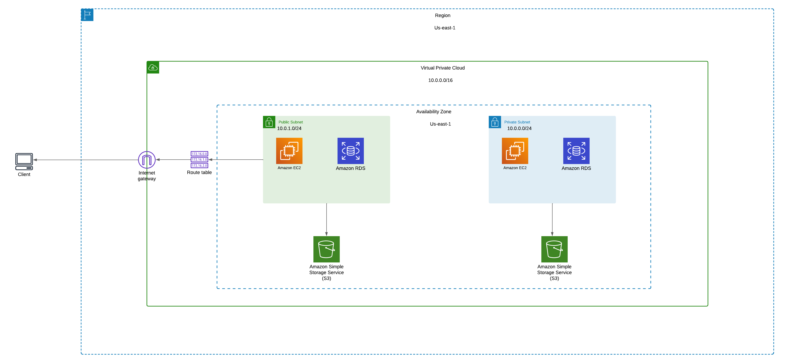

# Infraestructura como Código

## Proyecto
El proyecto consiste en la implementación de una infraestructura en la nube utilizando los servicios de Amazon Web Services (AWS) y gestionándolos como código utilizando Terraform. El objetivo principal es crear una infraestructura escalable, segura y eficiente para alojar aplicaciones y datos.

## Servicios
- VPC (Virtual Private Cloud): Se creará una VPC en la región US-east-1 de AWS. Se le asignará un rango de CIDR de 10.0.0.0/16.
- Subnets:
  1. Subred Pública:
     - Se configurará una subred pública dentro de la VPC.
     - Esta subred estará asociada a una tabla de ruteo que incluirá una ruta hacia el Internet Gateway, permitiendo el acceso a Internet desde los recursos desplegados en esta subred.
     - Su rango de CIDR será 10.0.1.0/24.
  2. Subred Privada:
     - Se configurará una subred privada dentro de la VPC.
     - Esta subred estará aislada de Internet y no tendrá una ruta directa al Internet Gateway.
     - Su rango de CIDR será 10.0.0.0/24.
     - Los recursos desplegados en esta subred no tendrán direcciones IP públicas y estarán protegidos del acceso no autorizado desde Internet.
- Internet Gateway: Se configurará un Internet Gateway para permitir la comunicación bidreccional entre la infraestructura en la nube y la Internet pública.
- Tabla de Ruteo: Se creará una tabla de ruteo para dirigir el tráfico entre subredes privadas y públicas, asi como reglas para el acceso a Internet a través del Internet Gateway.
- EC2 Instances: Se crearán dos instancias EC2 para alojar las aplicaciones o servicios deseados.
- Amazon RDS Instances: Se configurarán dos instancias de Amazon RDS (Relational Database Service) para gestionar bases de datos relacionales.
- S3 Buckets: Se crearán dos buckets S3 para almacenar objetos como archivos estáticos, imágenes, archivos de configuración.

### Diagrama de Arquitectura

## Entorno de desarrollo

